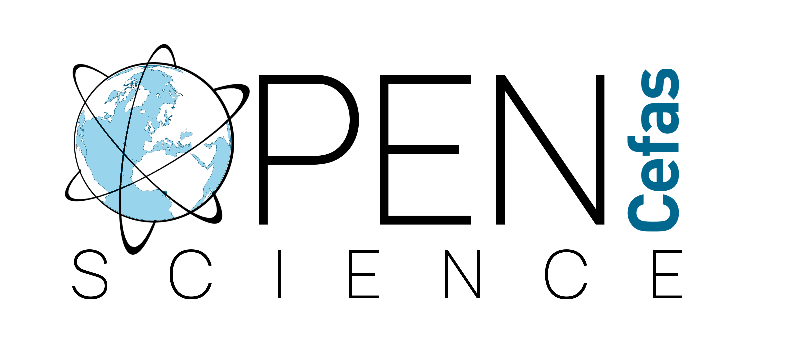

# OpenScienceFramework
SQL , R platform (R Development Core Team, 2017) and Python are the most widely used programming languages at Cefas for data exploration, visualisation, modelling and statistical analysis.

The methods developed using these programming languages can be made accesible using Github, packages, R Markdown and Python Jupiter Notebooks for the creation of interactive documents or web user interface using R Shiny apps . These web products allow users to interact with science methods and outputs, without any requirement for software or a need to understand complex code. R Shiny allows scientists to create web data tools without deep web programming knwoledge and therefore establishing a straight communication with the scientific communitiy , decision makers and other stakeholders. 

Cefas Open Science Framework (OSF) Seedcorn projects aims to develop a set of descriptive , good practice documents and training material designed for scientist, IT experts, project managers and business developer. The OSF includes a catalogue of recommended open source software available in Cefas and provides the required systems to store, analyse, publish and access scientific methods and data.
