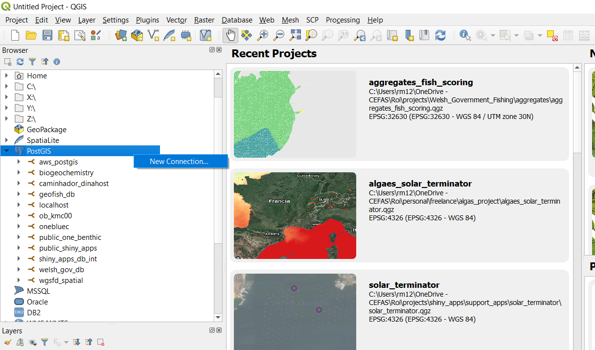
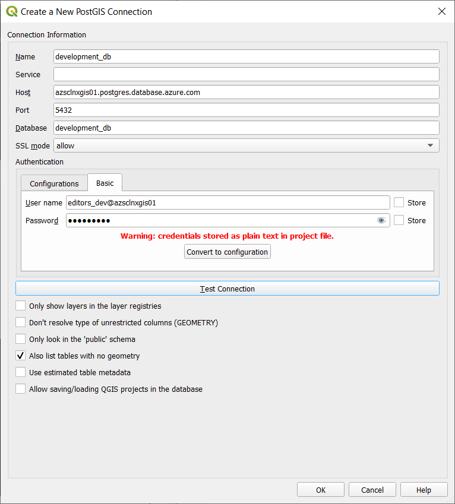
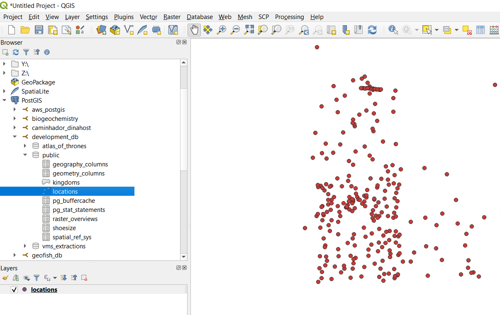

## Connect to PostgreSQL from QGIS

### 1. Set up your connection 

Open your QGIS destop application and be sure you have the Brower Panel open . If the Browser panel doesnt appears  you would have to open by menu option 'VIEW' ,  then 'PANELS' and click on 'BROWSER' panel . 

Once the Browser Panel is shown navigate until you find the **POSTGIS** option and with right click you can establish a 'NEW CONNECTION' as shown in the image belwo. 

#### 1.1 Connectivity details

You have to introduce now the details of a new connection to the PostgreSQL Database. The connection details to a database are common independently of the system used to access to PostgreSQL . Therefore write them down in a secure place to be used in future connections. 

The PostgreSQL connection details required are: 

- **HOST**: address of the server where the PostgreSQL DB is hosted
- **DATABASE**: The name of the database you are aiming to connect 
- **PORT**: By default is PostgreSQL Server listen trhough the port 5432 
- **SSL**: Secure connectivity to the databses activated or not . Cefas Database are using SSL , therefore we will 'Allow' it. 
- **USER & PASSWORD**: Your users and password details that will provide predetermined rights into the DB. ( Read, Write , Update, etc ) .

### 2. Add a layer to your Project 

Once we have a success connection to our PostgreSQL database , we can epxlore the tables and spatial data in the database using the browser. 
You can add into the Layers list the desired spatial table right clicking in the desired table and select 'Add Layer to Project'. 

